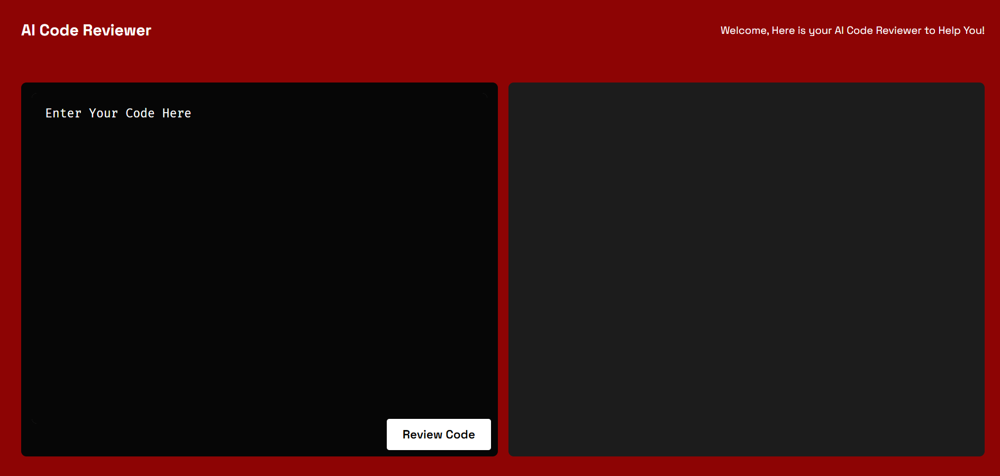
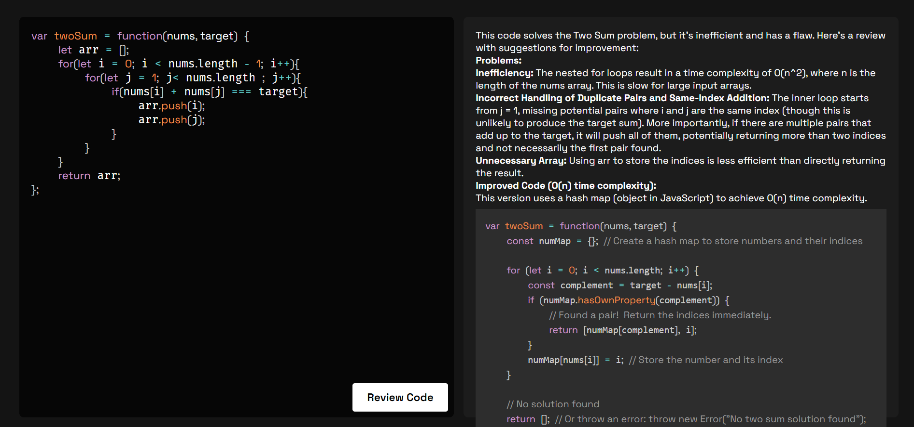
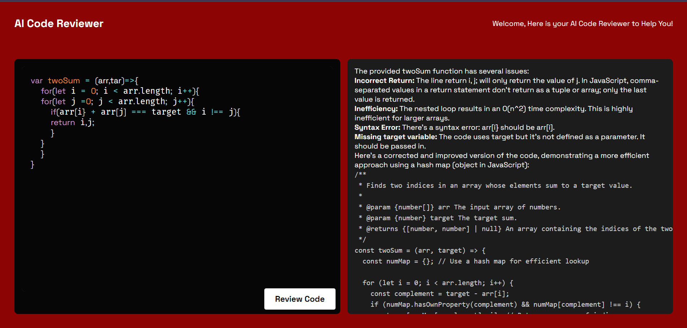

# 🤖 AI Code Reviewer



**AI Code Reviewer** is an intelligent MERN stack-based application (without a database) that allows developers to submit code snippets and receive:

- ✅ Code corrections
- 💡 Optimization suggestions
- 🚀 Best practices and alternative approaches

This tool leverages the **Gemini API (Google's GenAI model)** to review your code and help you become a better developer, faster.

---

## 🛠️ Tech Stack

| Layer     | Technology             |
| --------- | ---------------------- |
| Frontend  | React.js, Tailwind CSS |
| Backend   | Node.js, Express.js    |
| AI Engine | Gemini API (Google)    |
| Database  | ❌ Not required        |

---

## 🔥 Features

- 🚀 Paste any code (JavaScript, Python, etc.)
- 🤖 Get AI-generated reviews, suggestions, and improvements
- 🧠 Semantic understanding using Gemini AI
- ✨ Clean, responsive, and beginner-friendly UI
- 💬 Shows multiple improvement approaches (if applicable)

---

## 📸 Screenshots




---

## 🧑‍💻 How It Works

1. **Paste your code** in the input area.
2. Click on **“Review Code”**.
3. The backend sends the code to the **Gemini API**.
4. Gemini analyzes and returns:
   - Fixes for syntax or logic issues
   - Optimized and clean code
   - Suggested best practices
5. All results are displayed on the UI for easy comparison and learning.

---

## 🚀 Getting Started

### 1. Clone the repo

```bash
git clone https://github.com/your-username/ai-code-reviewer.git
cd ai-code-reviewer
```

### 2. Install dependencies

Backend

```cd server
 npm install
```

Frontend

```
cd client
npm install
```

### 3. Setup Gemini API

Get your Gemini API key from Google AI Studio.

Create a .env file in server/:

GEMINI_API_KEY=your_api_key_here
PORT=5000

### 4. Run the app

Start backend

```
cd server
nodemon server.js
```

Start frontend

```
cd client
npm run dev
```

Frontend runs on http://localhost:3000
Backend runs on http://localhost:5000

## Folder Structure

```
ai-code-reviewer/
├── client/ # React Frontend
│ └── components/
│ └── pages/
│ └── App.js
├── server/ # Express Backend
│ └── routes/
│ └── controllers/
│ └── services/ # Gemini integration logic
│ └── index.js
├── README.md
```

## Gemini API Integration (Overview)

The code is sent to the Gemini API using a POST request.

Gemini responds with a comprehensive analysis.

The backend formats this response and sends it to the frontend.

## Contact

Feel free to reach out if you have any questions or suggestions!

- [Website](https://adityadhiman.in)
- [GitHub](https://github.com/adityadhiman-in)
- [LinkedIn](https://www.linkedin.com/in/adityadhiman-in)

Made with ❤️ by [Aditya Dhiman](https://adityadhiman.in)
